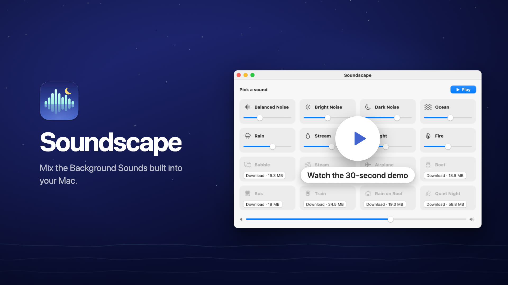
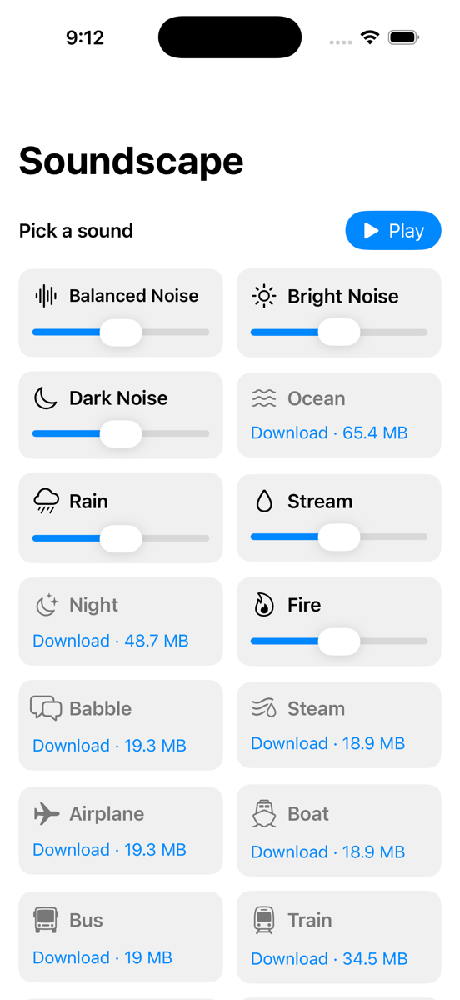
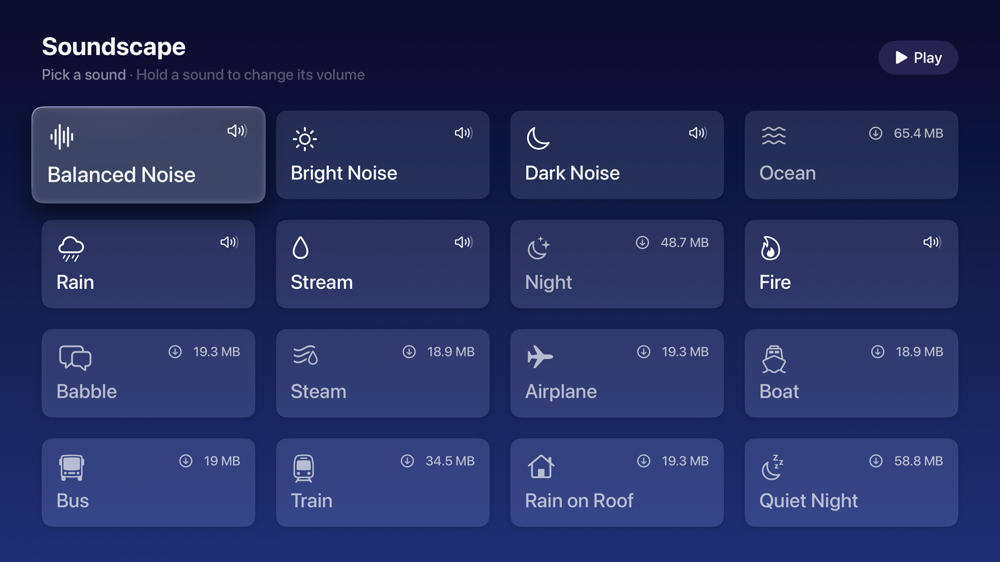

Tranquillity Maker mixes the Background Sounds built into macOS. Turn on Rain, Fire and Night together, give each one its own volume, and control the mix from the menu bar. It runs on [iPhone and iPad](#iphone-and-ipad) too, and there's an experimental [Apple TV version](#apple-tv).

Apple makes 16 of these sounds, from Balanced Noise to Rain on Roof, but macOS plays only one at a time. Tranquillity Maker plays as many as you want and loops each one without a gap.

Read the announcement and watch the 30-second demo on my blog: [I built Tranquillity Maker, a mixer for the Background Sounds on your Mac](https://flaviocopes.com/tranquillity-maker/).

[](https://flaviocopes.com/tranquillity-maker/)

## Download

Get `Tranquillity-Maker-1.5.0.zip` from the [latest release](https://github.com/flaviocopes/tranquillity-maker/releases/latest), unzip it, and drag Tranquillity Maker to your Applications folder. It runs on macOS 15 Sequoia or later, on Apple silicon and Intel Macs.

### Opening it the first time

Tranquillity Maker is signed with my Apple Developer ID and notarized by Apple. The first time you open it, macOS asks if you're sure you want to open an app downloaded from the internet. Click **Open**.

On a work laptop you might not be able to install apps in `/Applications`. You can keep Tranquillity Maker in the `Applications` folder inside your home folder instead.

## Features

- All 16 Background Sounds, including the eight Apple added in macOS Tahoe, even on Sequoia
- As many sounds at once as you like, each with its own volume, plus a master volume
- Loops that never gap: each sound crossfades into its next segment over 4 seconds
- Sounds fade in when you turn them on and fade out when you turn them off
- The whole mixer in a menu bar panel, with an icon that fills in while something plays
- **Play** brings back your last mix, and `Space` does the same while the window or the panel is open
- The play/pause key on the keyboard pauses and resumes the mix from any app, as long as Tranquillity Maker is the app that played last
- Sounds your Mac doesn't have yet show their size and download from Apple with one click
- Your mix and volumes are remembered between launches
- Updates from inside the app: it checks GitHub once a day, and **Install and Relaunch** puts the new version in place
- It keeps playing when you plug in headphones or switch the output device
- Light and dark appearance following the macOS setting

<picture>
  <source media="(prefers-color-scheme: dark)" srcset="docs/screenshot-dark.png" />
  
</picture>

## iPhone and iPad

The iPhone and iPad app has the same screen as the Mac window: tap a sound's name to turn it on, set its volume with its slider, and download the sounds you don't have yet with one tap. The mix keeps playing when you lock the screen, and the lock screen and Control Center show it with a play/pause button. A call or Siri pauses it, and **Play** brings it back.



It isn't on the App Store, so you install it from Xcode:

1. Connect the iPhone or iPad to your Mac with a cable and unlock it.
2. Open `Soundscape.xcodeproj`, choose the `SoundscapeiOS` scheme and your device, and set your own team under **Signing & Capabilities**.
3. Press `⌘R`. The first time, Xcode says Developer Mode is off. On the device, turn on **Settings → Privacy & Security → Developer Mode**, which shows up only after that first try, let it restart, and press `⌘R` again.

It needs iOS 18 or iPadOS 18 or later. With a free Apple account the app stops opening after 7 days, and with the paid Apple Developer Program after a year. Then run it from Xcode again.

## Apple TV

The Apple TV version is an experiment. The sounds are the property of Apple Inc., and Apple doesn't ship them with tvOS, so read the [Legal](#legal) section before you build it.

It has the same 16 sounds and the same gapless crossfades as the Mac app:

- Press a sound to turn it on or off. A sound that isn't on the Apple TV yet downloads first, then starts.
- Hold a sound to set its volume.
- The remote's play/pause button pauses and resumes the mix, in the app and from the home screen.
- The mix keeps playing when you go back to the home screen or the screensaver starts.



The Apple TV can't install apps from a zip, and the App Store doesn't take apps that play Apple's sounds. So you install it from Xcode on your own Apple TV, which takes a few minutes the first time:

1. Put the Mac and the Apple TV on the same network. On the Apple TV, open **Settings → Remotes and Devices → Remote App and Devices**.
2. In Xcode, open **Window → Devices and Simulators**, click **Pair** next to your Apple TV, and type the code it shows.
3. Open `Soundscape.xcodeproj`, choose the `SoundscapeTV` scheme and your Apple TV, and set your own team under **Signing & Capabilities**.
4. Press `⌘R`.

It needs tvOS 18 or later and an Apple Developer account. With a paid account, the app keeps working for a year. After that, run it from Xcode again.

## Where the sounds come from

Tranquillity Maker doesn't include any audio. It plays the same files macOS uses for Background Sounds:

- Sounds your Mac already has play right away, from `/System/Library/AssetsV2/com_apple_MobileAsset_ComfortSoundsAssets`.
- The others download from Apple's servers when you click **Download**, into `~/Library/Application Support/Soundscape/Sounds`. Delete that folder to remove them.
- On iPhone and iPad, apps can't read the copies iOS installs, so every sound downloads from Apple's servers into the app's own storage. Deleting the app removes them.
- On the Apple TV, every sound downloads from Apple's servers into the app's cache. tvOS empties it when it runs low on space, and the sound downloads again the next time you play it.

The files come straight from Apple to your device. They never go through a server of mine.

## Privacy

Tranquillity Maker goes online in three cases:

- At launch, it reads Apple's list of Background Sounds from `mesu.apple.com`, so the sounds added in newer macOS versions show up.
- When you click **Download**, it downloads that sound from Apple.
- Once a day, it asks GitHub whether there's a newer version of Tranquillity Maker. It downloads one only when you click **Install and Relaunch**.

There are no accounts, and nothing about you or your mix leaves your Mac. The iPhone, iPad and Apple TV versions do the first two and never check for updates.

To turn off the daily check, run this in Terminal. **Tranquillity Maker → Check for Updates…** still works.

```bash
defaults write com.flaviocopes.soundscape AppUpdaterAutomaticChecks -bool false
```

## Build it from source

You need macOS 15 or later and Xcode 26. The app icon is an Icon Composer file, and older Xcode versions can't build it.

Open `Soundscape.xcodeproj` and press `⌘R`. To build the release zip from the terminal, run:

```sh
scripts/build-release.sh
```

It builds a universal app in `build/release/Release/Tranquillity Maker.app` and zips it into `dist/`. With my Developer ID certificate in the keychain it signs and notarizes the app. Everywhere else it signs it ad hoc, so your copy is signed ad hoc. A copy you build yourself opens without a warning on your Mac.

If you send it to another Mac, macOS says it "could not verify Tranquillity Maker is free of malware". Click **Done**, then go to **System Settings → Privacy & Security** and click **Open Anyway**.

## Development

The Xcode project is generated from `project.yml` with [XcodeGen](https://github.com/yonaskolb/XcodeGen). After editing `project.yml`, regenerate it:

```sh
xcodegen generate
```

The app icons are drawn in code. Edit `scripts/render-icon.swift`, then write a new `Soundscape/AppIcon.icon`, which the Mac, iPhone and iPad share, and the Apple TV icon in `SoundscapeTV/Assets.xcassets`:

```sh
swift scripts/render-icon.swift
```

The screenshots come from the real app views. The script plays three sounds with the audio muted, and uses its own settings, so your saved mix stays as it is:

```sh
scripts/screenshot.sh
```

The banner uses the icon and the dark screenshot:

```sh
swift scripts/render-banner.swift
```

Working with an AI coding agent? Point it at [AGENTS.md](AGENTS.md). It has the commands and the rules to follow.

## How it works

Tranquillity Maker reads the catalog macOS uses for Background Sounds, a property list on Apple's servers with every sound and its download link. Each sound is between 1 and 20 audio files, each 1 to 2.5 minutes long.

Every sound gets two `AVAudioPlayerNode`s in one `AVAudioEngine`. Tranquillity Maker picks a random file, never the same one twice in a row when there's a choice, and queues it on the audio clock so it overlaps the previous one by 4 seconds with an equal-power crossfade. The next file is always queued before the current one ends, so a busy moment in the app can't cause a gap.

## Legal

Tranquillity Maker is an independent project. It isn't affiliated with, endorsed by or sponsored by Apple.

The Background Sounds belong to Apple. The repository, the source code and the release zip contain none of Apple's audio files. Tranquillity Maker plays the copies macOS installs, or downloads them from Apple's servers to your device, the same way macOS and iOS do. It doesn't host or redistribute them.

The sounds are part of macOS, iOS and iPadOS, so Apple's [software license agreements](https://www.apple.com/legal/sla/) for them cover the sounds, and using them within their terms is up to you. That means listening to them on a Mac, iPhone or iPad you own or control. Don't copy the files off it, share them, or put them in videos, podcasts, streams or other projects.

iPhone and iPad come with these same Background Sounds, in **Settings → Accessibility → Audio & Visual → Background Sounds**, and Apple's catalog for iOS lists the same files as the one for macOS. So on those devices Tranquillity Maker plays sounds that are already part of iOS.

The Apple TV version is an experiment. The sounds are the property of Apple Inc., and the licenses that cover them are written for Macs, iPhones and iPads. tvOS doesn't come with Background Sounds, so the Apple TV version downloads the macOS ones, and the license doesn't cover playing them on an Apple TV. Whether you build and use it is your call.

Apple can change or remove the sounds, and the servers they download from, at any time. If that happens, downloads in Tranquillity Maker stop working.

Apple, Mac and macOS are trademarks of Apple Inc., registered in the U.S. and other countries and regions.

## License

The [MIT license](LICENSE) covers Tranquillity Maker's source code only. It gives you no rights to Apple's sounds. Tranquillity Maker is provided as is, without warranty of any kind.
