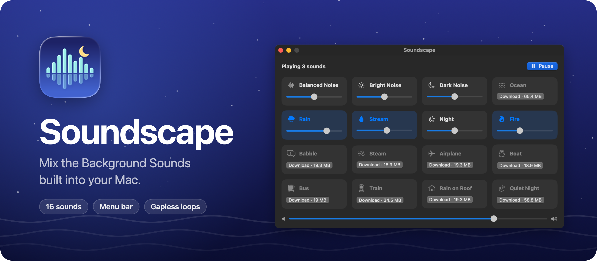
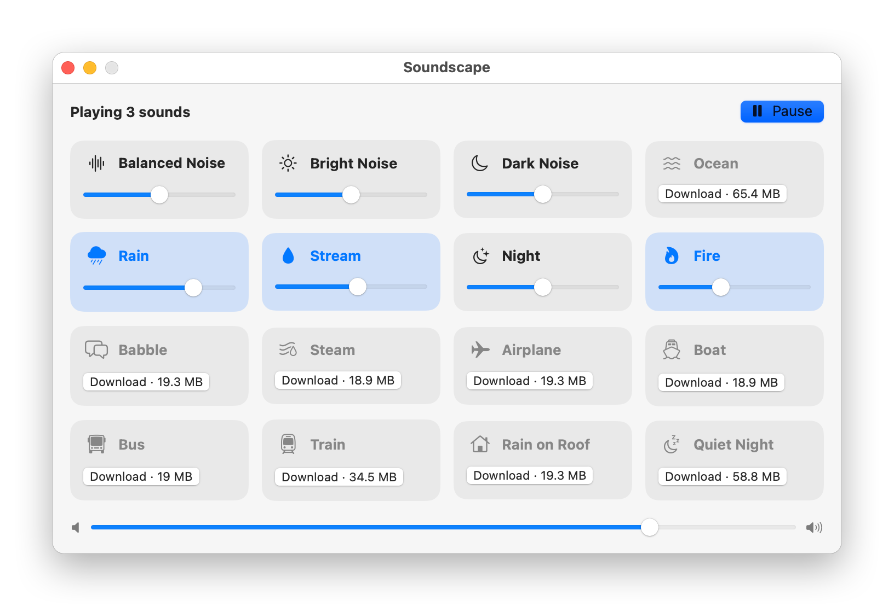

Soundscape mixes the Background Sounds built into macOS. Turn on Rain, Fire and Night together, give each one its own volume, and control the mix from the menu bar.

Apple makes 16 of these sounds, from Balanced Noise to Rain on Roof, but macOS plays only one at a time. Soundscape plays as many as you want and loops each one without a gap.

## Download

Get `Soundscape-1.0.0.zip` from the [latest release](https://github.com/flaviocopes/soundscape/releases/latest), unzip it, and drag Soundscape to your Applications folder. It runs on macOS 15 Sequoia or later, on Apple silicon and Intel Macs.

### Opening it the first time

Soundscape isn't signed with an Apple Developer ID or notarized by Apple. So the first time you open it, macOS says it "could not verify Soundscape is free of malware". Click **Done**, then allow it in one of two ways.

In System Settings, open **Privacy & Security** and scroll down to the message about Soundscape. Click **Open Anyway**, confirm, and open the app again. The button shows up for about an hour after you try to open the app.

In Terminal, remove the quarantine flag macOS adds to downloaded files, then open the app:

```sh
xattr -dr com.apple.quarantine /Applications/Soundscape.app
```

The same command fixes a message saying Soundscape is damaged. You don't need to turn off Gatekeeper for either option.

On a work laptop you might not be able to install apps in `/Applications`. You can keep Soundscape in the `Applications` folder inside your home folder, and run the command on `~/Applications/Soundscape.app`. If your company blocks apps that aren't notarized, ask your IT team.

## Features

- All 16 Background Sounds, including the eight Apple added in macOS Tahoe, even on Sequoia
- As many sounds at once as you like, each with its own volume, plus a master volume
- Loops that never gap: each sound crossfades into its next segment over 4 seconds
- Sounds fade in when you turn them on and fade out when you turn them off
- The whole mixer in a menu bar panel, with an icon that fills in while something plays
- **Play** brings back your last mix, and `Space` does the same while the window or the panel is open
- Sounds your Mac doesn't have yet show their size and download from Apple with one click
- Your mix and volumes are remembered between launches
- It keeps playing when you plug in headphones or switch the output device
- Light and dark appearance following the macOS setting

<picture>
  <source media="(prefers-color-scheme: dark)" srcset="docs/screenshot-dark.png" />
  
</picture>

## Where the sounds come from

Soundscape doesn't include any audio, and it isn't affiliated with Apple. It plays the same files macOS uses for Background Sounds:

- Sounds your Mac already has play right away, from `/System/Library/AssetsV2/com_apple_MobileAsset_ComfortSoundsAssets`.
- The others download from Apple's servers when you click **Download**, into `~/Library/Application Support/Soundscape/Sounds`. Delete that folder to remove them.

## Privacy

Soundscape goes online in two cases:

- At launch, it reads Apple's list of Background Sounds from `mesu.apple.com`, so the sounds added in newer macOS versions show up.
- When you click **Download**, it downloads that sound from Apple.

There are no accounts, and nothing about you or your mix leaves your Mac.

## Build it from source

You need macOS 15 or later and Xcode 26. The app icon is an Icon Composer file, and older Xcode versions can't build it.

Open `Soundscape.xcodeproj` and press `⌘R`. To build the release zip from the terminal, run:

```sh
scripts/build-release.sh
```

It builds a universal app in `build/release/Release/Soundscape.app`, checks its signature, and zips it into `dist/`. The app is ad-hoc signed. A copy you build yourself opens without a warning.

## Development

The Xcode project is generated from `project.yml` with [XcodeGen](https://github.com/yonaskolb/XcodeGen). After editing `project.yml`, regenerate it:

```sh
xcodegen generate
```

The app icon is drawn in code. Edit `scripts/render-icon.swift`, then write a new `Soundscape/AppIcon.icon`:

```sh
swift scripts/render-icon.swift
```

The screenshots come from the real app views. The script plays three sounds with the audio muted, and uses its own settings, so your saved mix stays as it is:

```sh
scripts/screenshot.sh
```

The banner uses the icon and the dark screenshot:

```sh
swift scripts/render-banner.swift
```

Working with an AI coding agent? Point it at [AGENTS.md](AGENTS.md). It has the commands and the rules to follow.

## How it works

Soundscape reads the catalog macOS uses for Background Sounds, a property list on Apple's servers with every sound and its download link. Each sound is between 1 and 20 audio files, each 1 to 2.5 minutes long.

Every sound gets two `AVAudioPlayerNode`s in one `AVAudioEngine`. Soundscape picks a random file, never the same one twice in a row when there's a choice, and queues it on the audio clock so it overlaps the previous one by 4 seconds with an equal-power crossfade. The next file is always queued before the current one ends, so a busy moment in the app can't cause a gap.

## License

[MIT](LICENSE)
